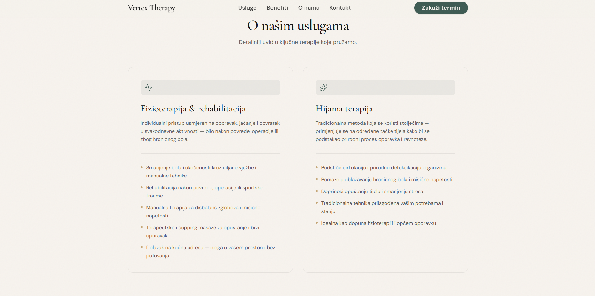
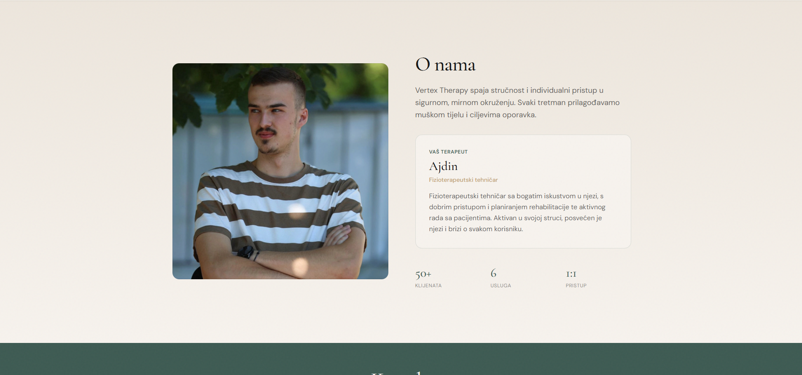
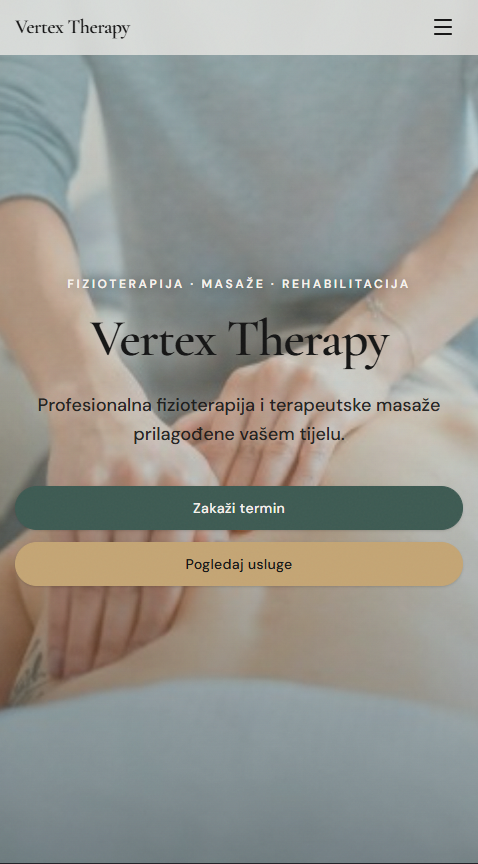

# Vertex Therapy Website

Professional physiotherapy clinic website focused on premium branding, trust-building, and responsive user experience.

<h2>Project Showcase</h2>

<p align="center">
  
</p>

<p align="center">
  
  
</p>

<p align="center">
  
</p>

## Overview

Vertex Therapy is a modern website developed for a physiotherapy and rehabilitation practice. The goal of the project was to create a clean, professional online presence that complements the client's social media marketing strategy and provides visitors with an easy way to learn about the clinic and its services.

## Features

- Modern and premium user interface
- Fully responsive design
- Mobile-first experience
- Service showcase sections
- Smooth scrolling navigation
- Optimized performance
- Professional visual branding
- Contact section for client inquiries

## Tech Stack

- Vite
- React
- TypeScript
- Tailwind CSS
- Vercel

## Project Goals

This project was designed to serve as a professional digital presence rather than a traditional lead-generation landing page.

Main objectives:

- Build trust and credibility
- Showcase services clearly
- Maintain a premium brand image
- Provide a smooth mobile experience
- Support traffic coming from social media platforms

## Development Highlights

- Custom responsive layout
- Performance-focused implementation
- Clean component architecture
- Consistent design system
- Cross-device optimization

## Live Demo

🔗 https://vertextherapy.net

## Screenshots

### Homepage

```html

```

### Services Section

```html

```

### Mobile Experience

```html

```

## Status

✅ Completed  
✅ Deployed  
✅ Production Ready
